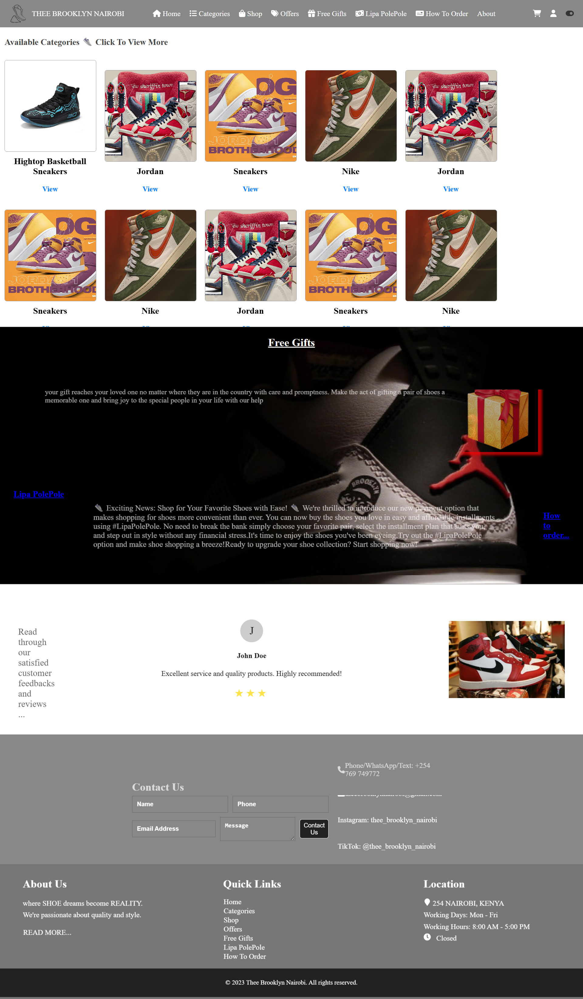
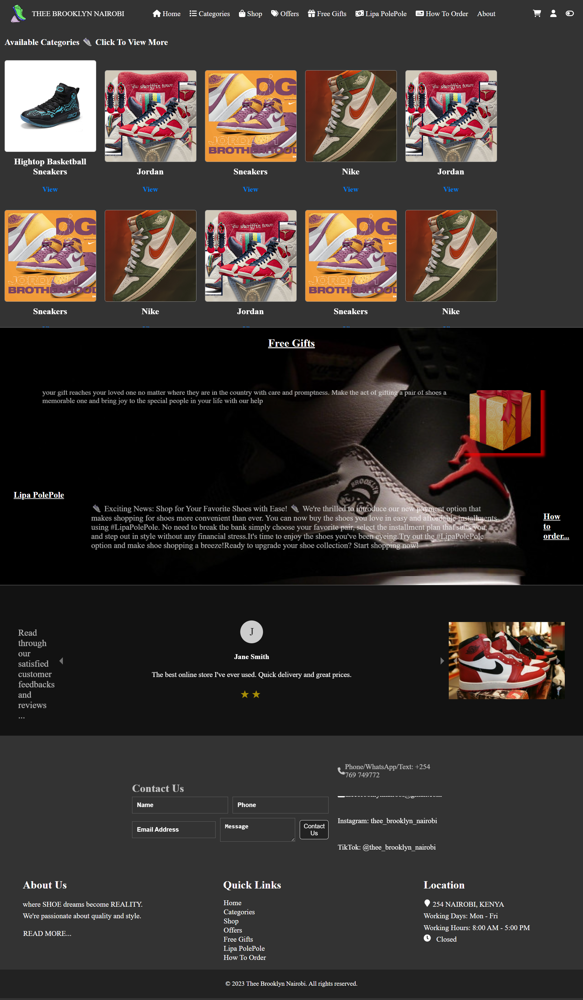

# Shoe Selling Site with React + Vite

Welcome to the Shoe Selling Site project! This template provides a minimal setup to get React working in Vite with Hot Module Replacement (HMR) and some ESLint rules. It's designed to help you quickly set up both the backend and frontend for your shoe selling site, complete with image support.

## Features

- **React + Vite**: A fast and efficient development environment.
- **Hot Module Replacement (HMR)**: Instant feedback as you develop.
- **ESLint**: Ensures code quality and consistency.
- **Image Support**: Seamlessly integrate images for both backend and frontend.

## Official Plugins

Currently, two official plugins are available to enhance your development experience:

1. **[@vitejs/plugin-react](https://github.com/vitejs/vite-plugin-react/blob/main/packages/plugin-react/README.md)**
   - Uses [Babel](https://babeljs.io/) for Fast Refresh.

2. **[@vitejs/plugin-react-swc](https://github.com/vitejs/vite-plugin-react-swc)**
   - Uses [SWC](https://swc.rs/) for Fast Refresh.

## Getting Started

To get started with the Shoe Selling Site project, follow these steps:

1. **Clone the Repository**: Clone this repository to your local machine.
2. **Install Dependencies**: Run `npm install` to install all necessary dependencies.
3. **Start Development Server**: Run `npm run dev` to start the development server.
4. **Add Images**: Place your images in the designated folders for both backend and frontend.

## Project Structure

- **Backend**: Contains server-side code and image handling.
- **Frontend**: Contains client-side code and image integration.

## Contributing

We welcome contributions! Feel free to open issues, submit pull requests, or suggest improvements.

## License

This project is licensed under the MIT License. See the [LICENSE](LICENSE) file for more details.

Happy coding! 👟💻